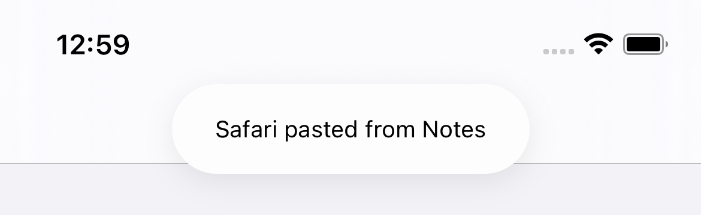
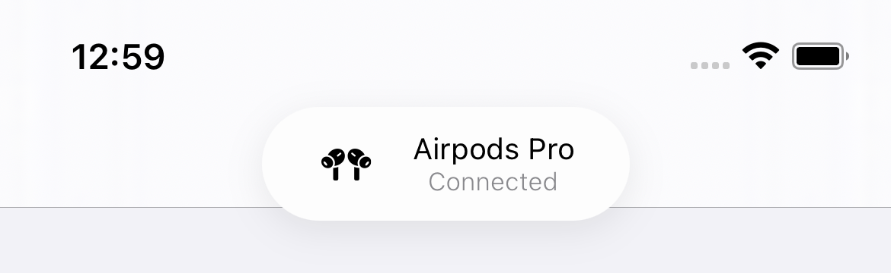

# NotificationToast

A view that tries to replicate iOS default toast message view.
| Title  | Icon | Subtitle |
| ------------- | ------------- | ------------- |
|   |  |  |

# Usage
Add this lib to your project using SPM.
```
import NotificationToast

let toast = ToastView(title: "Safari pasted from Notes")
toast.show()
```
The view also includes optional subtitle and leading icon view :
```
let toast = ToastView(title: "Airpods Pro", subtitle: "Connected", icon: UIImage(systemName: "airpodspro"))
toast.show()
```

# Contribute
As this is my first 'UI' package I'm sure it can be greatly improved, PR are welcome 😊

